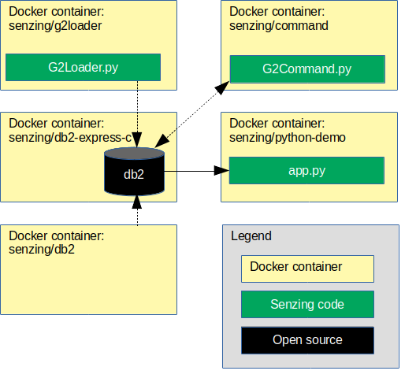

# docker-compose-db2-demo

## Overview

The following diagram shows the relationship of the docker containers in this docker composition.



This docker formation brings up the following docker containers:

1. *[senzing/db2express-c](https://github.com/Senzing/docker-db2express-c)*
1. *[senzing/python-demo](https://github.com/Senzing/docker-python-demo)*

Also shown in the demonstration are commands to run the following Docker images:

1. *[senzing/g2loader](https://github.com/Senzing/docker-g2loader)* in [Run G2Loader.py](#run-g2loaderpy)
1. *[senzing/g2command](https://github.com/Senzing/docker-g2command)* in [Run G2Command.py](#run-g2commandpy)

### Contents

1. [Expectations](#expectations)
    1. [Space](#space)
    1. [Time](#time)
    1. [Background knowledge](#background-knowledge)
1. [Preparation](#preparation)
    1. [Prerequisite Software](#prerequisite-software)
    1. [Clone repository](#clone-repository)
    1. [Create SENZING_DIR](#create-senzing_dir)
    1. [Db2 client](#db2-client)
1. [Using docker-compose](#using-docker-compose)
    1. [Build docker images](#build-docker-images)
    1. [Configuration](#configuration)
    1. [Launch docker formation](#launch-docker-formation)
    1. [Initialize database](#initialize-database)
    1. [Run G2Loader.py](#run-g2loaderpy)
    1. [Sample python app](#sample-python-app)
    1. [Run G2Command.py](#run-g2commandpy)
1. [Cleanup](#cleanup)

## Expectations

### Space

This repository and demonstration require 6 GB free disk space.

### Time

Budget 2 hours to get the demonstration up-and-running, depending on CPU and network speeds.

### Background knowledge

This repository assumes a working knowledge of:

1. [Docker](https://github.com/Senzing/knowledge-base/blob/master/WHATIS/docker.md)
1. [Docker-Compose](https://github.com/Senzing/knowledge-base/blob/master/WHATIS/docker-compose.md)

## Preparation

### Prerequisite software

The following software programs need to be installed:

1. [docker](https://github.com/Senzing/knowledge-base/blob/master/HOWTO/install-docker.md)
1. [docker-compose](https://github.com/Senzing/knowledge-base/blob/master/HOWTO/install-docker-compose.md)

### Clone repository

1. Set these environment variable values:

    ```console
    export GIT_ACCOUNT=senzing
    export GIT_REPOSITORY=docker-compose-db2-demo
    ```

1. Follow steps in [clone-repository](https://github.com/Senzing/knowledge-base/blob/master/HOWTO/clone-repository.md) to install the Git repository.

1. After the repository has been cloned, be sure the following are set:

    ```console
    export GIT_ACCOUNT_DIR=~/${GIT_ACCOUNT}.git
    export GIT_REPOSITORY_DIR="${GIT_ACCOUNT_DIR}/${GIT_REPOSITORY}"
    ```

### Create SENZING_DIR

If you do not already have an `/opt/senzing` directory on your local system, visit
[HOWTO - Create SENZING_DIR](https://github.com/Senzing/knowledge-base/blob/master/HOWTO/create-senzing-dir.md).

### Db2 client

If you do not already have the Db2 client installed into `/opt/senzing`, visit
[HOWTO - Install Db2 Client](https://github.com/Senzing/knowledge-base/blob/master/HOWTO/install-db2-client.md).

## Using docker-compose

### Build docker images

1. Build docker images.

    ```console
    sudo docker build --tag senzing/db2express-c https://github.com/senzing/docker-db2express-c.git
    ```

### Configuration

- **DB2_DATABASE** -
  The database schema name.
  Default: "G2"
- **DB2_STORAGE** -
  Path on local system where the database files are stored.
  Default: "/storage/docker/senzing/docker-compose-db2-demo"
- **DB2INST1_PASSWORD** -
  The password for the "db2inst1" user name.
  Default: "db2inst1"
- **SENZING_DIR** -
  Path on the local system where
  [Senzing_API.tgz](https://s3.amazonaws.com/public-read-access/SenzingComDownloads/Senzing_API.tgz)
  has been extracted.
  See [Create SENZING_DIR](#create-senzing_dir).
  No default.
  Usually set to "/opt/senzing".

### Launch docker formation

1. :pencil2: Set environment variables.  Example:

    ```console
    export DB2_DATABASE=G2
    export DB2_STORAGE=/storage/docker/senzing/docker-compose-db2-demo
    export SENZING_DIR=/opt/senzing
    ```

1. Launch docker-compose formation.  Example:

    ```console
    cd ${GIT_REPOSITORY_DIR}

    sudo \
      DB2_DATABASE=${DB2_DATABASE} \
      DB2_STORAGE=${DB2_STORAGE} \
      SENZING_DIR=${SENZING_DIR} \
      docker-compose up
    ```

    **Note:** The log will show errors from `senzing-app` until the database has been initialized in the next step.

    The database storage will be on the local system at ${DB2_STORAGE}.
    The default database storage path is `/storage/docker/senzing/docker-compose-db2-demo`.

### Initialize database

In a separate terminal window:

1. Log into `senzing-db2` container. Example:

    ```console
    sudo docker exec \
      --interactive \
      --tty \
      senzing-db2 /bin/bash
    ```

1. Populate database. In `senzing-db2` docker container, run

    ```console
    su - db2inst1
    db2 create database g2 using codeset utf-8 territory us
    db2 connect to g2
    db2 -tf /opt/senzing/g2/data/g2core-schema-db2-create.sql
    db2 connect reset
    ```

### Sample python app

1. After the schema and data are loaded,
   the demonstration python/Flask app will be available at
   [localhost:5000](http://localhost:5000).

### Run G2Loader.py

For more information on `senzing/g2loader` configuration and usage, see
[senzing/docker-g2loader](https://github.com/Senzing/docker-g2loader).

In a separate terminal window:

1. :pencil2: Determine docker network. Example:

    ```console
    sudo docker network ls

    # Choose value from NAME column of docker network ls
    export SENZING_NETWORK=nameofthe_network
    ```

1. :pencil2: Set environment variables.  Example:

    ```console
    export SENZING_DIR=/opt/senzing

    export DATABASE_PROTOCOL=db2
    export DATABASE_USERNAME=db2inst1
    export DATABASE_PASSWORD=db2inst1
    export DATABASE_HOST=senzing-db2
    export DATABASE_PORT=50000
    export DATABASE_DATABASE=G2
    ```

1. Run `docker` command. Example:

    ```console
    export SENZING_DATABASE_URL="${DATABASE_PROTOCOL}://${DATABASE_USERNAME}:${DATABASE_PASSWORD}@${DATABASE_HOST}:${DATABASE_PORT}/${DATABASE_DATABASE}"

    sudo docker run \
      --env SENZING_DATABASE_URL="${SENZING_DATABASE_URL}" \
      --interactive \
      --net ${SENZING_NETWORK} \
      --rm \
      --tty \
      --volume ${SENZING_DIR}:/opt/senzing \
      senzing/g2loader \
        --purgeFirst \
        --projectFile /opt/senzing/g2/python/demo/sample/project.csv
    ```

### Run G2Command.py

For more information on `senzing/g2command` configuration and usage, see
[senzing/docker-g2command](https://github.com/Senzing/docker-g2command).

In a separate terminal window:

1. :pencil2: Determine docker network. Example:

    ```console
    sudo docker network ls

    # Choose value from NAME column of docker network ls
    export SENZING_NETWORK=nameofthe_network
    ```

1. :pencil2: Set environment variables.  Example:

    ```console
    export SENZING_DIR=/opt/senzing

    export DATABASE_PROTOCOL=db2
    export DATABASE_USERNAME=db2inst1
    export DATABASE_PASSWORD=db2inst1
    export DATABASE_HOST=senzing-db2
    export DATABASE_PORT=50000
    export DATABASE_DATABASE=G2
    ```

1. Run `docker` command. Example:

    ```console
    export SENZING_DATABASE_URL="${DATABASE_PROTOCOL}://${DATABASE_USERNAME}:${DATABASE_PASSWORD}@${DATABASE_HOST}:${DATABASE_PORT}/${DATABASE_DATABASE}"

    sudo docker run \
      --env SENZING_DATABASE_URL="${SENZING_DATABASE_URL}" \
      --interactive \
      --net ${SENZING_NETWORK} \
      --rm \
      --tty \
      --volume ${SENZING_DIR}:/opt/senzing \
      senzing/g2command
    ```

## Cleanup

In a separate terminal window:

1. Run `docker-compose` command.

    ```console
    cd ${GIT_REPOSITORY_DIR}
    sudo docker-compose down
    ```

1. Delete database storage.

    ```console
    sudo rm -rf ${DB2_STORAGE}
    ```

1. Delete SENZING_DIR.

    ```console
    sudo rm -rf ${SENZING_DIR}
    ```

1. Delete git repository.

    ```console
    sudo rm -rf ${GIT_REPOSITORY_DIR}
    ```
